# Computer-Vision-Photometric-Stereo

Umich EECS 442 (Winter 2018) homework 1 by Wenzhe Xu

Keywords: shape from shading

## Introduction
In this homework, pictures of a same object under different directions of light source are given. Furthermore, these light directions are given as well. A height map of this object is asked. In short words, object's shape is inferenced from its shading.

#### Assumptions:

* A Lambertian object  
* A local shading model (each point on a surface receives light only from sources visible at that point)  
* A set of known light source directions  
* A set of pictures of an object, obtained in exactly the same
camera/object configuration but using different sources  
* Orthographic projection

#### Lambert's Law
$$B = \rho N\cdot S$$

where  

* $$B$$: [scalar] radiosity (total power leaving the surface per unit area)
* $$\rho$$: [scalar] albedo (fraction of incident irradiance reflected by the surface)
* $$N$$: [vector] unit normal (outwards)
* $$S$$: [vector] source vector (from the surface to the source, magnitude proportional to intensity of the source)

The camera model maps the point $$(x,y,z)$$ in space to the point $$(x,y)$$ in the camera, as the following figure shows.


The shape of the surface is then represented as a function of position in the image, known as the height function $$f(x,y)$$.

Assume the response of the camera is linear in surface radiosity. Hence the pixel value at $$(x,y)$$ is 

$$I(x,y) = kB(x,y) = k\rho(x,y)N(x,y)\cdot S$$

Without loss of generality, it is safe to choose $$k=1$$ in this homework. Note that within each image, the light source direction $$S$$ is assumed to be constant for every location $$(x,y)$$. To find this $$g(x,y)$$ vector, the following linear system is set up. ($$k=1$$). As a summary, scalor $$I_j(x,y)$$ and vector $$S_j$$ are knowns and vector $$g(x,y) = \rho(x,y)N(x,y)$$ is unknown.

$$I_j(x,y) = S_j\cdot g(x,y)$$

where $$j$$ is the image index. For example, $$j=1,\cdots, 64$$ for 64 images. Each pixel has 64 equations with 3 unknowns (vector $$g(x,y) = [g_1(x,y), g_2(x,y), g_3(x,y)]^T$$). An overdetermined system is solved with the least squares method for best fitting.

Once the vector $$g(x,y) = \rho(x,y)N(x,y)$$ is achieved, the magnitude $$\rho(x,y)$$ and unit direction $$N(x,y)$$ can be calculated. The final piece to find height map $$f(x,y)$$ is then estimated by noting its relations to $$N(x,y)$$.

#### f(x,y) from N(x,y)
If a surface $$S$$ is given implicitly as the set of points $$(x,y,z)$$ satisfying $$F(x,y,z) = 0$$, then a normal at a point $$(x,y,z)$$ on the surface is given by $$\nabla F(x,y,z)$$. In our case, surface $$S$$ is

$$F(x,y,z) = z-f(x,y) = 0$$

A normal at a point $$(x,y,z)$$ on the surface is $$[-\partial_x f(x,y), -\partial_y f(x,y), 1]^T$$. Hence the partial derivatives of the surface are

$$\partial_x f(x,y) = -g_1(x,y)/g_3(x,y)$$

$$\partial_y f(x,y) = -g_2(x,y)/g_3(x,y)$$

Finally, the surface $$f(x,y)$$ can be recovered at any point by integration along some path.

$$f(x,y) = \int_0^x \partial_x f(s,0)ds + \int_0^y \partial_y f(x,t)dt + C$$

## Method
Three functions need to be implemented: `prepareData.m`, `photometricStereo.m`, and `getSurface.m`. 

#### `prepareData.m`
Three steps are:

* Substract the ambientImage from each image in imArray
* Make sure no pixel is less than zero
* Rescale the values in imarray to be between 0 and 1 

```matlab
function output = prepareData(imArray, ambientImage)
[h,w,~] = size(imArray);
step1 = bsxfun(@minus, imArray, ambientImage);
step2 = bsxfun(@max, step1, zeros(h,w));
output = step2/255.0;
```

The ambient image needs to be subtracted from all other images to get rid of any ambient light effect that those images might have. Use `bsxfun` with function handle `@minus` to apply element-wise subtraction.

Pixel values cannot be negative. Again, `bsxfun` with function handle `@max` to set the lower bound with a proper-sized `zeros` matrix.

These pixel values are rescaled to [0,1] \(originally [0,255]\) for float format use. 

#### `photometricStereo.m`
This function takes as input the image stack corresponding to the different light source directions and returns an albedo image and surface normal estimates. The surface is assumed to be perfectly Lambertian. Inputs' and outputs' dimensions are listed below.

Input:

* imArray - [h w n], n images of size [h w]
* lightDirs - [n 3], n corresponding light source direction vector, each has i,j,k coordinates

Output:

* albedoImage - [h w], albedo image of size [h w]
* surfaceNormals - [h w 3], there are [h w] pixels and at each pixel location, the surface has the normal vector in i,j,k coordinates

```matlab
function [albedoImage, surfaceNormals] = photometricStereo(imArray, lightDirs)
[h,w,n] = size(imArray);
I = reshape(imArray,[h*w,n])';
g = lightDirs\I;
rho = sqrt(g(1,:).^2 + g(2,:).^2 + g(3,:).^2);
albedoImage = reshape(rho,[h,w]);
N = g./rho;
surfaceNormals = reshape(N',[h,w,3]);
```

The overdetermined system $$Vg = I$$ has the following dimensions.

Knowns:

* V - [n 3], the input matrix lightDirs. Each row $$j$$ represents the light source direction corresponding to the $$j$$ image.
* I - [n hw], the image pixel matrix. Each row $$j$$ represents the $$j$$ image. The pixels for this image are indexed in the following way:

```
a d
b e    -->    [a b c d e f] 
c f
```

Unknowns:

* g - [3 hw], $$\rho N$$ vector. Each column represents one pixel location or one point on the surface. Three rows are its i,j,k coordinates.

Hence the least-squares problem is solved by backslash operator, `g = V\I`. For more details, take $$j$$th row of V, `V(j,:)` (light source direction for the $$j$$th image), the $$i$$th location has $$\rho_i N_i$$ vector given in the $$i$$ column of matrix g, i.e. `g(:,i)` so that this location's pixel value `I(j,i)` best fitted with the dot product between `V(j,:)` and `g(:,i)`.

At each location, the scalar $$\rho$$ is the magnitude of $$g = [g_1,g_2,g_3]^T$$, which is 

$$\rho = \sqrt{g_1^2 + g_2^2 + g_3^2}$$

and the unit normal direction vector is calculated by normalizing its magnitude.

$$N = \frac{[g_1,g_2,g_3]^T}{\sqrt{g_1^2 + g_2^2 + g_3^2}}$$

`reshape` function is used to index the pixel in a way mentioned above.

#### `getSurface.m`
This function calculates the height map given the surface normal vector. For this discrete case, the integral reduces to a summation of their discrete partial derivatives along some path. Different paths produce different height map. Four integration schemes are required to be implemented. `column`, `row`, `average`, `random`

For the `column` and `row` method, we integrate from the center of the image. This is reasonable since a non-shiny smooth area (near the noise) exists on these faces. The `column` method starts from the center and first integrates horizontally using $$dhdx$$, then the height map for the other locations are calculated vertically using $$dhdy$$. The `row` method starts from the center and first integrates vertically using $$dhdy$$, then the height map for the other locations are calculated horizontally using $$dhdx$$. The `average` method uses the average of the height map from the `column` and `row` methods as pixel values. The `random` method is discussed below.

#### `random` method
Since the line connecting (x,y+1,h(x,y+1)) and (x+1,y+1,h(x+1,y+1)) is approximately perpendicular to average normal between these two points. We can solve for h(x+1,y+1) using both horizontal and vertical neighbour pixels.

$$h(i,j) = h(i-1,j) + \frac{h_y(i-1,j) + h_y(i,j)}{2}$$

$$h(i,j) = h(i,j-1) + \frac{h_x(i,j-1) + h_x(i,j)}{2}$$

Adding these two equations and dividing by 2

$$h(i,j) = \frac{h(i-1,j) + h(i,j-1)}{2} + \frac{h_y(i-1,j) + h_y(i,j) + h_x(i,j-1) + h_x(i,j)}{4}$$

To account for starting point effect, a "Four Pass" algorithm is used, which means the average of these four paths is taken as the final height map. Compared to the `average` method which averages the `column` and the `row` method, this `random` method adds two integration paths. One starts from (1,1) and goes in diagonal pattern and the other starts from (1,end) and goes in the anti-diagonal pattern.

**start from (1,1)**  
For j = 2,...,end, i = 2,...,end, height map for boundaries (top and left)

$$h(1,j) = h(1,j-1) + h_x(1,j-1)$$

$$h(i,1) = h(i-1,1) + h_y(i-1,1)$$

Then height map for other locations is updated by

$$h(i,j) = \frac{h(i-1,j) + h(i,j-1)}{2} + \frac{h_y(i-1,j) + h_y(i,j) + h_x(i,j-1) + h_x(i,j)}{4}$$

**start from (1,end)**
For j=end-1,...,1, i = 2,...,end, height map for boundaries (top and right)

$$h(1,j) = h(1,j+1) - h_x(1,j+1)$$

$$h(i,end) = h(i-1,end) + h_y(i-1,end)$$

Then height map for other locations is updated by

$$h(i,j) = \frac{h(i-1,j) + h(i,j+1)}{2} + \frac{h_y(i-1,j) + h_y(i,j) - h_x(i,j+1)-h_x(i,j)}{4}$$

The reason why these two starting points are chosen is because the following integrability condition:  

$$\partial_{xy}h = \partial_{yx}h$$

After solving the $$\partial_xh$$ and $$\partial_yh$$, the $$\partial_{xy}h$$ and $$\partial_{yx}h$$ are calculated using the center difference numerical method. These two results should be equal for every points on the surface. The following four figures show the L2 norm difference between $$\partial_{xy}h$$ and $$\partial_{yx}h$$.

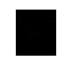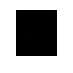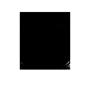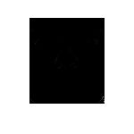

Note that the difference is observable at bottom left and bottom right corner in case B05 and B07. Hence starting from the top left and top right decreases the accumulate error and increases the accuracy confidence. 


This method takes the average of 4 paths as the final height map. For each pixel location, information about height and height gradients from all its four neighbours is used. Hence, by using this algorithm, a smoother height map is achieved with affordable computational cost.
## Result and Analysis
#### yaleB01
Albedo

Normals in color


x,y,z Normals


#### yaleB01 with `Column`
height map

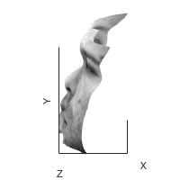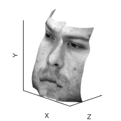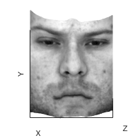
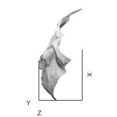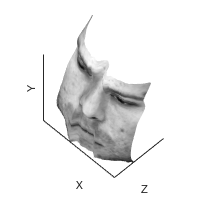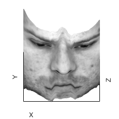
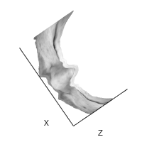

#### yaleB01 with `row`
height map

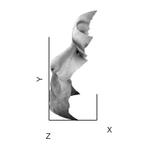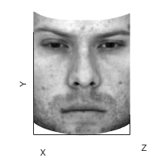
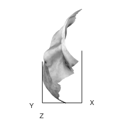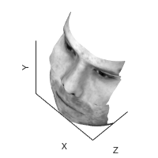
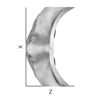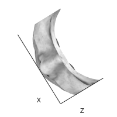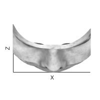

#### yaleB01 with `average`
height map

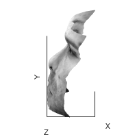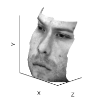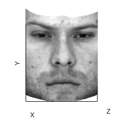
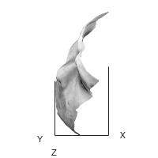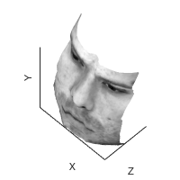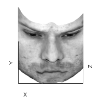
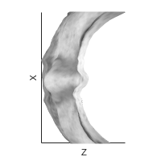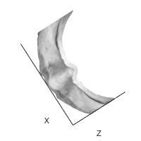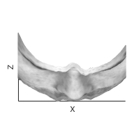

#### yaleB01 with `random`
height map

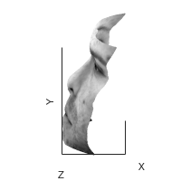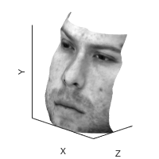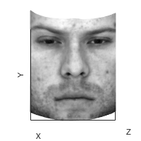
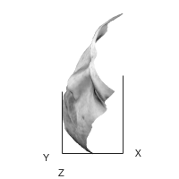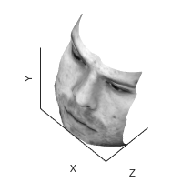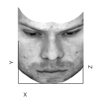
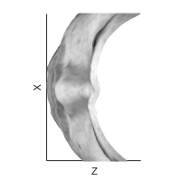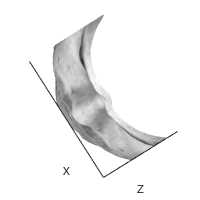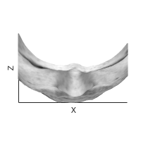

#### yaleB02
Albedo

Normals in color


x,y,z Normals


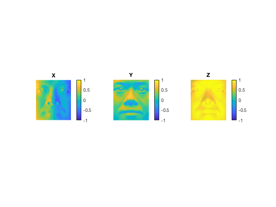
#### yaleB02 with `Column`
height map

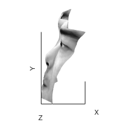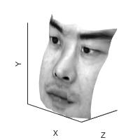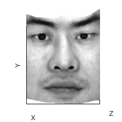
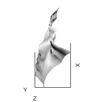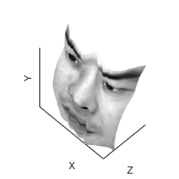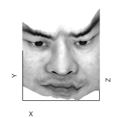
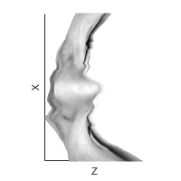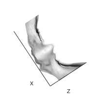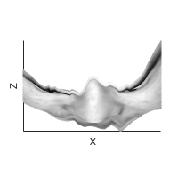

#### yaleB02 with `row`
height map

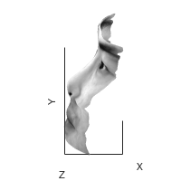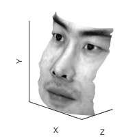
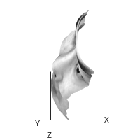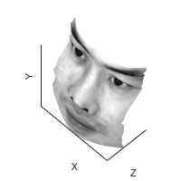


#### yaleB02 with `average`
height map


#### yaleB02 with `random`
height map


#### yaleB05
Albedo

Normals in color


x,y,z Normals


#### yaleB05 with `Column`
height map


#### yaleB05 with `row`
height map


#### yaleB05 with `average`
height map


#### yaleB05 with `random`
height map


#### yaleB07
Albedo

Normals in color


x,y,z Normals


#### yaleB07 with `Column`
height map


#### yaleB07 with `row`
height map


#### yaleB07 with `average`
height map


#### yaleB07 with `random`
height map


### Analysis
#### Comparison of reconstruction quality between four integration methods
The most straightforward integration methods are `column` and `row`. However, these two methods might introduce ridges in the reconstruction. Take case B01 for example. The `column` method starts from the center and integrates along x-axis, which means the horizontal centerline is constrained by dhdx and produces a smooth horizontal centerline. Then, the height map at other locations is determined by integrating dhdy vertically, which means all vertical lines are smooth but this loses their smoothness along the x-axis. Hence we have vertical ridges, as the following left figure shows (see area near the lip). Similarly, the `row` method starts from the center and integrates along the y-axis, which produces a smooth vertical centerline. Then, the height map at other locations is determined by integrating dhdx horizontally, which means all horizontal lines are smooth but this loses the vertical constrains dhdy. Hence we have horizontal ridges, as the following right figure shows (see area near the cheekbone).


The `average` method combines the `column` and `row` methods and brings back the 2D constrains dhdx and dhdy for all surface locations. The following two figures from `average` show a better reconstruction.


The `random` method adds two more integration paths in addition to `column` and `row` paths. It integrates along a diagonal pattern from the top left corner and along a anti-diagonal pattern form the top right corner. The reason why these two corners are chosen is the integrability check, as mentioned before. These two additional paths will assign more weights at the top than the bottom. Hence a more smooth surface is achieved, as the following figure shows.


Using this `random` method, horizontal ridges near the cheekbone and vertical ridges near the lip are successful smoothed out. Hence this `random` implementation outperforms the other four for face cases.

#### Comparison of computation cost between four integration methods
For computation complexity, the `column` and the `row` methods are similar, since they all traverse the pixel matrix once. The `average` method calls the `column` and the `row` method. Hence theoretically, the computation cost is about two times, if the averaging step is conducted within the second call. As for the `random` method, it traverse the pixel matrix four times. Hence the computation cost should be around 4 times as much as the `column` or `row` spends. The following experiment results of case B01 are their running time estimated by Matlab `tic` and `toc`.

```
          running time (sec)
column     0.000221
row        0.000237
average    0.000431
random     0.008351
```
The `random` method produces a better reconstruction with affordable cost. 

#### Violation of Shape-from-Shading method assumptions
First, Lambert's law is assumed in this reconstruction. Hence "shiny" parts like eyeballs or skin with makeup don't satisfy the diffuse reflection. Hence closing eyes when taking pictures might produce a better reconstruction.

Second, a local shading model is used, which means each point on a surface receives light only from sources visible at that point. It does not receives light from other points' reflection. 

Third, the reconstruction is not accurate at the shaddow area, like chin, and hair, etc. Moreover, the integration of gradient field requires the curvature of the surface be not large, at least not exceeding the resolution of the pixel. The following figure shows a failure reconstruction around chin and neck (face edges) with one of its input image.


The hair also projects a shadow in some of its input images, as the following figure shows.


